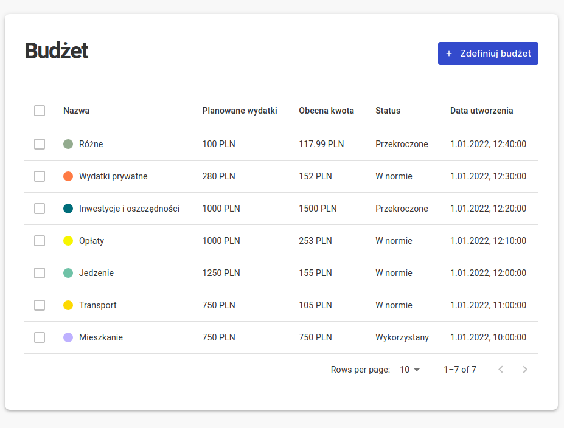

<div id="top"></div>

<!-- PROJECT LOGO -->
<br />
<div align="center">
  <a href="https://www.dareit.io">
    
  </a>

  <h3 align="center">Dare IT Budget App - Portfolio edition</h3>

  <p align="center">
    An awesome budget app inspired by Dare IT Portfolio Challenge
</div>

## ⭐ About The Project


You look at Budget App that I have made during my Dare IT portfolio challege.


My main challenge was getting to know new libraries and creating a working application from scratch based on provided boilerplate. Our great mentors prepared tasks that helped us create new functionalities and supported us during our 12-week programming journey.

### My good moments
- I learned how to use completely new libraries
- I got along with chart library
- I know how frontend and backend work together in larger apps
- MUI is not as bad as I thought
- I learned how to decide which tasks are most important when the deadline is approaching
- Friendly support during development is essential

### Built With :coffee: and...

During the project, I had the opportunity to get to know many new libraries and improve my skills with using others.
The most important one are:

* [React.js](https://reactjs.org/)
* [React Chartjs 2](https://react-chartjs-2.js.org/)
* [React Hook Form](https://react-hook-form.com/)
* [Material UI](https://mui.com/)
* [React Query](https://react-query.tanstack.com/)
* [Storybook](https://storybook.js.org/)
* [Notistack](https://iamhosseindhv.com/notistack)


<p align="right">(<a href="#top">back to top</a>)</p>

## 🏃 Getting Started

This is an example of how you may give instructions on setting up your project locally.
To get a local copy up and running follow these simple example steps.

### Prerequisites
You need node and npm on your system.

```sh
node -v
```
```sh
npm install npm@latest -g
```

### Installation


1. Clone the repo
```sh
git clone https://github.com/ireshka/react-challenge.git
```
2. Get into main project directory and install NPM packages (it may take some time, be patient!)
```sh
npm install
```

### Start & develop app
Start the app with provided npm script from main directory. It will start client & server parts of application at once.
```sh
npm run start
```

For using storybook run provided npm script & search it on `http://localhost:6006`
```sh
npm run storybook
```

For opening cypress test
```sh
npm run cypress: open
```


<p align="right">(<a href="#top">back to top</a>)</p>

##  Functionalities

As a user you can play with the app and:
- track your spendings and display your expenses and income in a table
- look at your budget and spendings on charts
- create a budget and track how much money you have left
- notifications show you if everything is ok during adding/removing elements to budget or ledger
<p align="right">(<a href="#top">back to top</a>)</p>


## Screenshots





<p align="right">(<a href="#top">back to top</a>)</p>

## App future

So many ideas, so little time

- [ ] app deployment - let it shine online
- [ ] dark theme
- [ ] authentication (user will use app on different devices)
- [ ] rewrite with Typescript for future development
- [ ] add a persistent database
- [ ] multi-language support
    - [x] Polish
    - [ ] English


<p align="right">(<a href="#top">back to top</a>)</p>
